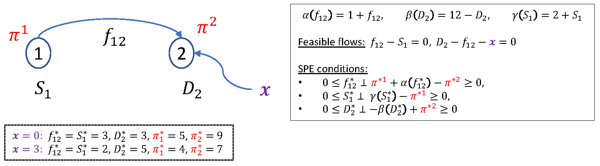
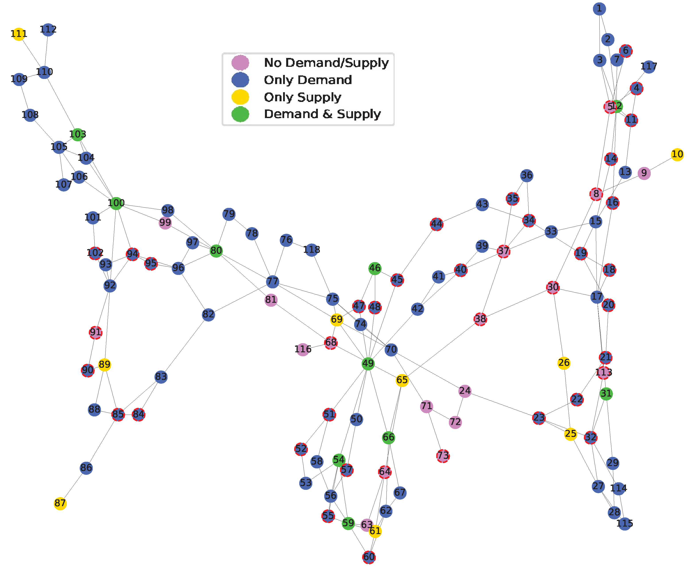
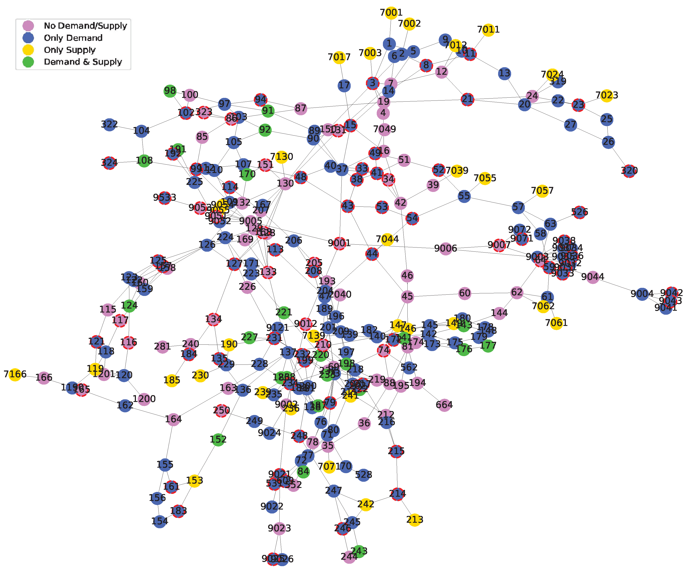
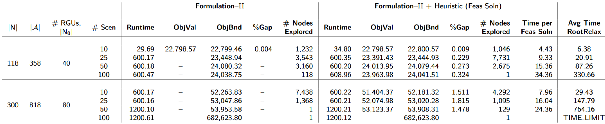

# Medium-instances_NetworkFacilityLocation

* [Nodes10_Arcs15_LocNodes8/](./Medium-instances_NetworkFacilityLocation/Upper-And-LowerLevel_Params_data/Nodes10_Arcs15_LocNodes8)
* [Nodes10_Arcs25_LocNodes8/](./Medium-instances_NetworkFacilityLocation/Upper-And-LowerLevel_Params_data/Nodes10_Arcs25_LocNodes8)
* [Nodes10_Arcs35_LocNodes8/](./Medium-instances_NetworkFacilityLocation/Upper-And-LowerLevel_Params_data/Nodes10_Arcs35_LocNodes8)
* [Nodes20_Arcs25_LocNodes15/](./Medium-instances_NetworkFacilityLocation/Upper-And-LowerLevel_Params_data/Nodes20_Arcs25_LocNodes15)
* [Nodes20_Arcs35_LocNodes15/](./Medium-instances_NetworkFacilityLocation/Upper-And-LowerLevel_Params_data/Nodes20_Arcs35_LocNodes15)
* [Nodes20_Arcs45_LocNodes15/](./Medium-instances_NetworkFacilityLocation/Upper-And-LowerLevel_Params_data/Nodes20_Arcs45_LocNodes15)
* [Nodes30_Arcs35_LocNodes22/](./Medium-instances_NetworkFacilityLocation/Upper-And-LowerLevel_Params_data/Nodes30_Arcs35_LocNodes22)
* [Nodes30_Arcs45_LocNodes22/](./Medium-instances_NetworkFacilityLocation/Upper-And-LowerLevel_Params_data/Nodes30_Arcs45_LocNodes22)
* [Nodes30_Arcs55_LocNodes22/](./Medium-instances_NetworkFacilityLocation/Upper-And-LowerLevel_Params_data/Nodes30_Arcs55_LocNodes22)
* [Nodes40_Arcs45_LocNodes30/](./Medium-instances_NetworkFacilityLocation/Upper-And-LowerLevel_Params_data/Nodes40_Arcs45_LocNodes30)
* [Nodes40_Arcs55_LocNodes30/](./Medium-instances_NetworkFacilityLocation/Upper-And-LowerLevel_Params_data/Nodes40_Arcs55_LocNodes30)
* [Nodes40_Arcs65_LocNodes30/](./Medium-instances_NetworkFacilityLocation/Upper-And-LowerLevel_Params_data/Nodes40_Arcs65_LocNodes30)

# Large-instances_NetworkFacilityLocation

* [Nodes100_Arcs100_LocNodes75/](./Large-instances_NetworkFacilityLocation/Upper-And-LowerLevel_Params_data/Nodes100_Arcs100_LocNodes75)
* [Nodes100_Arcs570_LocNodes75/](./Large-instances_NetworkFacilityLocation/Upper-And-LowerLevel_Params_data/Nodes100_Arcs570_LocNodes75)
* [Nodes100_Arcs1040_LocNodes75/](./Large-instances_NetworkFacilityLocation/Upper-And-LowerLevel_Params_data/Nodes100_Arcs1040_LocNodes75)
* [Nodes100_Arcs1510_LocNodes75/](./Large-instances_NetworkFacilityLocation/Upper-And-LowerLevel_Params_data/Nodes100_Arcs1510_LocNodes75)
* [Nodes100_Arcs1980_LocNodes75/](./Large-instances_NetworkFacilityLocation/Upper-And-LowerLevel_Params_data/Nodes100_Arcs1980_LocNodes75)
* [Nodes100_Arcs2450_LocNodes75/](./Large-instances_NetworkFacilityLocation/Upper-And-LowerLevel_Params_data/Nodes100_Arcs2450_LocNodes75)
* [Nodes100_Arcs2920_LocNodes75/](./Large-instances_NetworkFacilityLocation/Upper-And-LowerLevel_Params_data/Nodes100_Arcs2920_LocNodes75)
* [Nodes100_Arcs3390_LocNodes75/](./Large-instances_NetworkFacilityLocation/Upper-And-LowerLevel_Params_data/Nodes100_Arcs3390_LocNodes75)
* [Nodes100_Arcs3860_LocNodes75/](./Large-instances_NetworkFacilityLocation/Upper-And-LowerLevel_Params_data/Nodes100_Arcs3860_LocNodes75)
* [Nodes100_Arcs4330_LocNodes75/](./Large-instances_NetworkFacilityLocation/Upper-And-LowerLevel_Params_data/Nodes100_Arcs4330_LocNodes75)
* [Nodes100_Arcs4800_LocNodes75/](./Large-instances_NetworkFacilityLocation/Upper-And-LowerLevel_Params_data/Nodes100_Arcs4800_LocNodes75)
* [Nodes100_Arcs5270_LocNodes75/](./Large-instances_NetworkFacilityLocation/Upper-And-LowerLevel_Params_data/Nodes100_Arcs5270_LocNodes75)
* [Nodes100_Arcs5740_LocNodes75/](./Large-instances_NetworkFacilityLocation/Upper-And-LowerLevel_Params_data/Nodes100_Arcs5740_LocNodes75)
* [Nodes100_Arcs6210_LocNodes75/](./Large-instances_NetworkFacilityLocation/Upper-And-LowerLevel_Params_data/Nodes100_Arcs6210_LocNodes75)
* [Nodes100_Arcs6680_LocNodes75/](./Large-instances_NetworkFacilityLocation/Upper-And-LowerLevel_Params_data/Nodes100_Arcs6680_LocNodes75)

# IEEE-BusNetworks_RenewableEnergyLocation

* [IEEE_3-Bus_data/](./IEEE-BusNetworks_RenewableEnergyLocation/IEEE_3-Bus_data)
  * [LowerLevelParams/](./IEEE-BusNetworks_RenewableEnergyLocation/IEEE_3-Bus_data/LowerLevelParams)    
  * [UpperLevelParams.csv](./IEEE-BusNetworks_RenewableEnergyLocation/IEEE_3-Bus_data/IEEE_3-Bus_UpperLevelParams.csv)
  * [NumScenarios=1.csv](./IEEE-BusNetworks_RenewableEnergyLocation/IEEE_3-Bus_data/NumScenarios=1.csv); [NumScenarios=2.csv](./IEEE-BusNetworks_RenewableEnergyLocation/IEEE_3-Bus_data/NumScenarios=2.csv); [NumScenarios=3.csv](./IEEE-BusNetworks_RenewableEnergyLocation/IEEE_3-Bus_data/NumScenarios=3.csv)\
   [NumScenarios=4.csv](./IEEE-BusNetworks_RenewableEnergyLocation/IEEE_3-Bus_data/NumScenarios=4.csv); [NumScenarios=5.csv](./IEEE-BusNetworks_RenewableEnergyLocation/IEEE_3-Bus_data/NumScenarios=5.csv)
* [IEEE_14-Bus_data/](./IEEE-BusNetworks_RenewableEnergyLocation/IEEE_14-Bus_data)
  * [LowerLevelParams/](./IEEE-BusNetworks_RenewableEnergyLocation/IEEE_14-Bus_data/LowerLevelParams)    
  * [UpperLevelParams.csv](./IEEE-BusNetworks_RenewableEnergyLocation/IEEE_14-Bus_data/IEEE_14-Bus_UpperLevelParams.csv)
  * [NumScenarios=10.csv](./IEEE-BusNetworks_RenewableEnergyLocation/IEEE_14-Bus_data/NumScenarios=10.csv);  [NumScenarios=25.csv](./IEEE-BusNetworks_RenewableEnergyLocation/IEEE_14-Bus_data/NumScenarios=25.csv)\
    [NumScenarios=50.csv](./IEEE-BusNetworks_RenewableEnergyLocation/IEEE_14-Bus_data/NumScenarios=50.csv);  [NumScenarios=100.csv](./IEEE-BusNetworks_RenewableEnergyLocation/IEEE_14-Bus_data/NumScenarios=100.csv)
* [IEEE_30-Bus_data/](./IEEE-BusNetworks_RenewableEnergyLocation/IEEE_30-Bus_data)
  * [LowerLevelParams/](./IEEE-BusNetworks_RenewableEnergyLocation/IEEE_30-Bus_data/LowerLevelParams)
   * [IEEE_30-Bus_UpperLevelParams.csv](./IEEE-BusNetworks_RenewableEnergyLocation/IEEE_30-Bus_data/IEEE_30-Bus_UpperLevelParams.csv)
  * [NumScenarios=10.csv](./IEEE-BusNetworks_RenewableEnergyLocation/IEEE_30-Bus_data/NumScenarios=10.csv);  [NumScenarios=25.csv](./IEEE-BusNetworks_RenewableEnergyLocation/IEEE_30-Bus_data/NumScenarios=25.csv)\
    [NumScenarios=50.csv](./IEEE-BusNetworks_RenewableEnergyLocation/IEEE_30-Bus_data/NumScenarios=50.csv);  [NumScenarios=100.csv](./IEEE-BusNetworks_RenewableEnergyLocation/IEEE_30-Bus_data/NumScenarios=100.csv)
* [IEEE_57-Bus_data/](./IEEE-BusNetworks_RenewableEnergyLocation/IEEE_57-Bus_data)
  * [LowerLevelParams/](./IEEE-BusNetworks_RenewableEnergyLocation/IEEE_57-Bus_data/LowerLevelParams)
  * [UpperLevelParams.csv](./IEEE-BusNetworks_RenewableEnergyLocation/IEEE_57-Bus_data/IEEE_57-Bus_UpperLevelParams.csv)  
  * [NumScenarios=10.csv](./IEEE-BusNetworks_RenewableEnergyLocation/IEEE_57-Bus_data/NumScenarios=10.csv);  [NumScenarios=25.csv](./IEEE-BusNetworks_RenewableEnergyLocation/IEEE_57-Bus_data/NumScenarios=25.csv)\
    [NumScenarios=50.csv](./IEEE-BusNetworks_RenewableEnergyLocation/IEEE_57-Bus_data/NumScenarios=50.csv);  [NumScenarios=100.csv](./IEEE-BusNetworks_RenewableEnergyLocation/IEEE_57-Bus_data/NumScenarios=100.csv)     
* [IEEE_118-Bus_data/](./IEEE-BusNetworks_RenewableEnergyLocation/IEEE_118-Bus_data)
  * [LowerLevelParams/](./IEEE-BusNetworks_RenewableEnergyLocation/IEEE_118-Bus_data/LowerLevelParams)
  * [UpperLevelParams.csv](./IEEE-BusNetworks_RenewableEnergyLocation/IEEE_118-Bus_data/IEEE_118-Bus_UpperLevelParams.csv)
  * [Nodes118_Arcs186_LocNodes40.pdf](./IEEE-BusNetworks_RenewableEnergyLocation/IEEE_118-Bus_data/Nodes118_Arcs186_LocNodes40.pdf)
  * [NumScenarios=10.csv](./IEEE-BusNetworks_RenewableEnergyLocation/IEEE_118-Bus_data/NumScenarios=10.csv);  [NumScenarios=25.csv](./IEEE-BusNetworks_RenewableEnergyLocation/IEEE_118-Bus_data/NumScenarios=25.csv);\
    [NumScenarios=50.csv](./IEEE-BusNetworks_RenewableEnergyLocation/IEEE_118-Bus_data/NumScenarios=50.csv);  [NumScenarios=100.csv](./IEEE-BusNetworks_RenewableEnergyLocation/IEEE_118-Bus_data/NumScenarios=100.csv)    
* [IEEE_300-Bus_data/](./IEEE-BusNetworks_RenewableEnergyLocation/IEEE_300-Bus_data)
  * [LowerLevelParams/](./IEEE-BusNetworks_RenewableEnergyLocation/IEEE_300-Bus_data/LowerLevelParams)    
  * [UpperLevelParams.csv](./IEEE-BusNetworks_RenewableEnergyLocation/IEEE_300-Bus_data/IEEE_300-Bus_UpperLevelParams.csv)
  * [NumScenarios=10.csv](./IEEE-BusNetworks_RenewableEnergyLocation/IEEE_300-Bus_data/NumScenarios=10.csv);  [NumScenarios=25.csv](./IEEE-BusNetworks_RenewableEnergyLocation/IEEE_300-Bus_data/NumScenarios=25.csv);\
    [NumScenarios=50.csv](./IEEE-BusNetworks_RenewableEnergyLocation/IEEE_300-Bus_data/NumScenarios=50.csv);  [NumScenarios=100.csv](./IEEE-BusNetworks_RenewableEnergyLocation/IEEE_300-Bus_data/NumScenarios=100.csv)
    
# Examples-Bilevel-Progs-with-Spatial-Price-Eqbm-Constrs
* **Toy Example**
  
  

* **Large instances for locating renewable energy units**:
    * **IEEE 118 Bus Network**
      
  
  
    * **IEEE 300 Bus Network**
      
  

* <ins>**Results on above networks**</ins>

