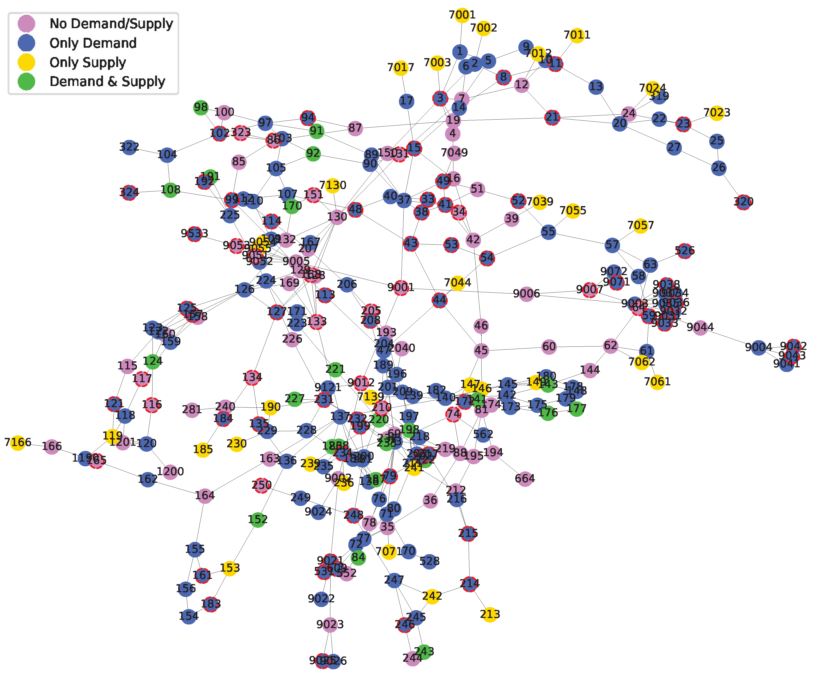

# Data-for-Bilevel-Progs-with-Spatial-Price-Eqbm-Constrs
* **Toy Example**
  

* **Large instances for locating renewable energy units**:
    * IEEE 118 Bus Network
  
  
    * IEEE 300 Bus Network
  
